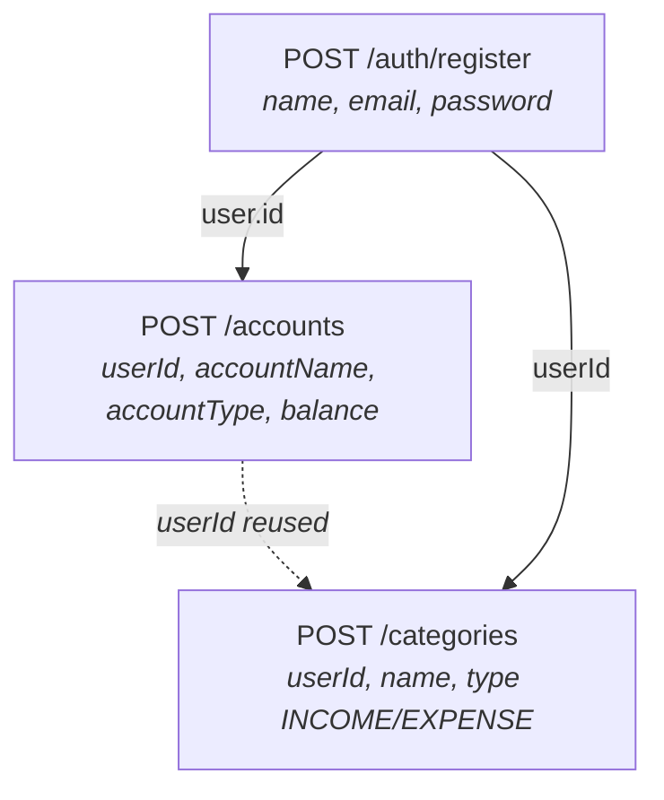
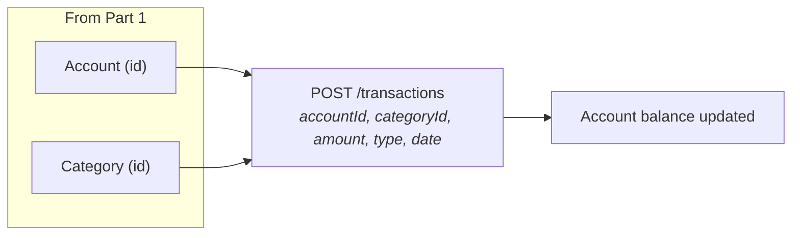
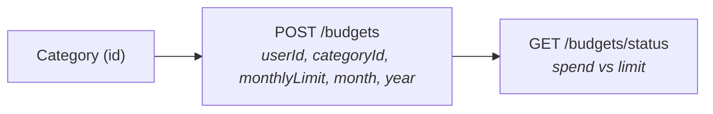
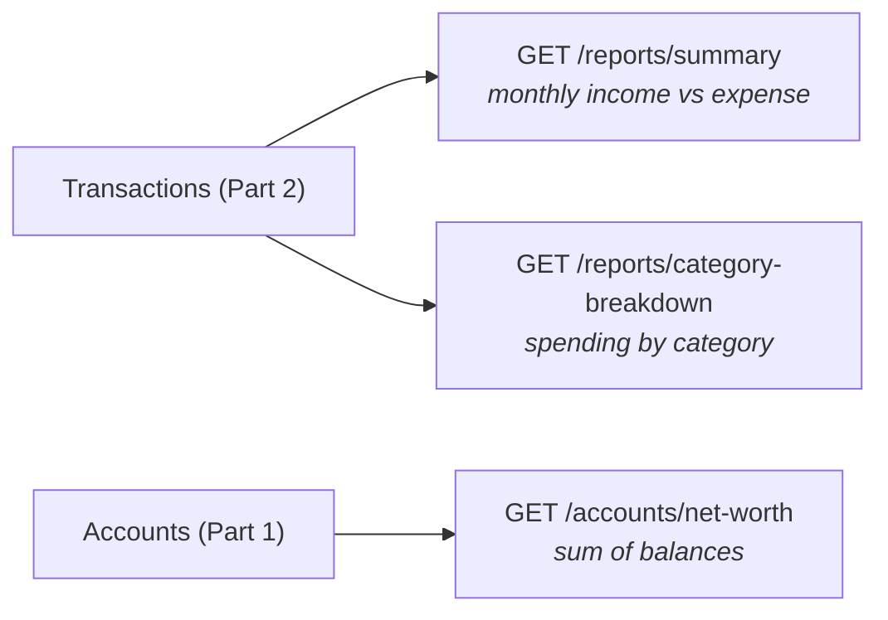
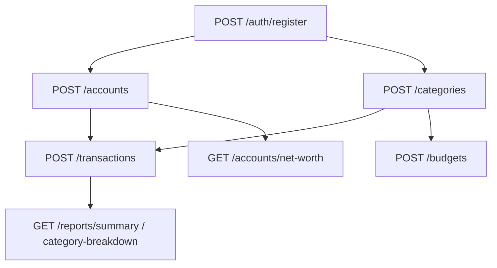

# Personal Finance Tracker

Backend REST API for managing personal finances: multi-account management, income/expense tracking, category budgets, and financial reports. Documented via Swagger UI — no frontend.

## Tech Stack

- Java 25
- Spring Boot 4.1.0
- Maven (multi-module) + Maven Wrapper
- Spring Data JPA / Hibernate
- PostgreSQL
- Lombok
- HikariCP (connection pool)
- springdoc-openapi 3.0.3 (Swagger UI)

## Project Structure

```
personal-finance-tracker/
├── pom.xml                  # Parent POM (packaging=pom) - shared deps & build config
├── common/                  # Shared module: entities, enums, DTOs, mappers, exceptions
│   └── src/main/java/com/example/common/
├── core-api/                # App module (Runnable): Auth, Accounts, Transactions
│   ├── pom.xml
│   └── src/main/
│       ├── java/com/example/coreapi/   # CoreApiApplication + controllers/services/security
│       └── resources/                   # application.yaml (DB config lives here)
└── reporting-api/           # Library module: Categories, Budgets, Reports
    ├── pom.xml
    └── src/main/java/com/example/reportingapi/
```

> `core-api` depends on both `reporting-api` and `common`, so running the single `CoreApiApplication`
> boots ONE context containing all modules — a single Swagger UI with every endpoint.

## Prerequisites

1. **JDK 25** installed (`java -version` should report 25.x).
2. **PostgreSQL** running locally.

## Database Setup

1. Create the database:

   ```sql
   CREATE DATABASE personal_finance_db;
   ```

2. Open `core-api/src/main/resources/application.yaml` and set your credentials:

   ```yaml
   spring:
     datasource:
       url: "jdbc:postgresql://localhost:5432/personal_finance_db"
       username: postgres        # change to your user
       password:     # change to your password
   ```

   - `ddl-auto: update` creates/updates the tables automatically on startup, so no schema script is required.

3. (Optional) Profiles are available as `application-dev.yaml` / `application-prod.yaml`.
   Switch profiles by editing `spring.profiles.active` (default is `local`).

## Run the Project

Use the Maven wrapper (no local Maven install needed):

```bash
# Build the whole project (compiles common, core-api, reporting-api)
./mvnw clean install

# Run the application (core-api module)
./mvnw -pl core-api spring-boot:run
```

Or run `CoreApiApplication` directly from your IDE (VS Code launch config is already set up in `.vscode/launch.json`).

## Verify

- Swagger UI: http://localhost:9090/swagger-ui.html
- OpenAPI JSON: http://localhost:9090/v3/api-docs
- Server port: `9090` (configurable in `application.yaml`)

## Endpoints (Overview)

| Module | Area | Base Path |
|---|---|---|
| core-api | Auth | `/auth` (register, login) |
| core-api | Accounts | `/accounts` (CRUD, transfer, net-worth) |
| core-api | Transactions | `/transactions` (CRUD, filters, history) |
| reporting-api | Categories | `/categories` (CRUD) |
| reporting-api | Budgets | `/budgets` (CRUD, status) |
| reporting-api | Reports | `/reports` (summary, category breakdown) |

See the full API spec in Swagger UI, and the BRD in `../Personal_Finance_Tracker_BRD_v3.md`.

---

## Usage Flow (Mermaid)

The API is used in a fixed order because later resources depend on earlier ones. Each new resource needs the `id` returned in the previous step's response. Flows are split into small parts below.

### Part 1 — Setup: User, Account, Category

Create the three "owning" resources first. Each of these only needs the `id` of the one before it.



### Part 2 — Transactions (money movement)

Transactions link an **account** and a **category** (both from Part 1). Creating/editing/deleting a transaction automatically adjusts the account balance (INCOME adds, EXPENSE subtracts).



### Part 3 — Budget & Status

A budget targets a category for a given month/year. Spend-vs-limit status can be checked against it.



### Part 4 — Reports (read-only)

Reports aggregate the transactions created in Part 2.



### Full Flow (combined)

